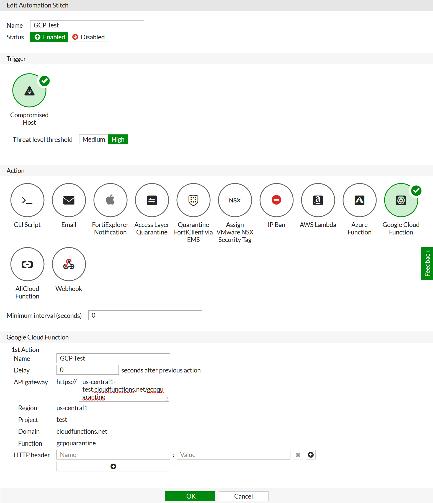

# Introduction
This Google Cloud Function works with a Fortigate Automation Action to change the network tag of a requested Compute instance to one specified in an environment variable. This function uses Node.js 8 and works by first fetching a list of VMs and sorting through them for the VM with the IP address specified in the Fortigate trigger; it then attaches a network tag (specified in an environment variable) to the VM.

> **Note:** Currently only anonymous GCP functions are supported. It is recommended that you secure your function to prevent unauthorized access.

# Set up the Google Cloud function

This function requires a service account to be set up with an Access Key and Secret. For details on setting up a Service Account, refer to the Google Cloud article [Creating and managing service accounts](https://cloud.google.com/iam/docs/creating-managing-service-accounts).

  1. In the Google Cloud Platform, select **Cloud Functions**.
  2. Click **Create Function**.
  3. Enter a function **Name**.
  4. Set the **Trigger** to **HTTP**.
  5. Set the **Runtime** to **Node.js 8**.
  6. Copy and paste or upload the `index.js` code and JSON package.
  7. For **Function to Execute**, type `main`.
  8. Under **Advanced Options**, select a service account with **Compute** privileges.
  9. Click **Add Variables** and add the following Environment Variables:
     * **NETWORK_QUARANTINE_TAG**: The network Firewall tag you will apply to the VM.
     * **VPC_NAME**: The name of the VPC in which you will check for the VMs.
  10. Click **Create**.

# Set up the FortiGate

  1. Log into your FortiGate.
  2. Select **Security Fabric > Automation**.
  3. Click **Create New**.
  4. Enter a **Name** for the Automation Stitch.
  5. Under **Trigger**, select **Compromised Host**.
  6. Under **Action**, select **Google Cloud Function**.
  7. Set the **Google Cloud Function** parameters, with the **API gateway** and the settings generated in the previous section.

An example is shown below.

  

# Support
Fortinet-provided scripts in this and other GitHub projects do not fall under the regular Fortinet technical support scope and are not supported by FortiCare Support Services.
For direct issues, please refer to the [Issues](https://github.com/fortinet/gcp-security-group-update/issues) tab of this GitHub project.
For other questions related to this project, contact [github@fortinet.com](mailto:github@fortinet.com).

## License
[License](./LICENSE) © Fortinet Technologies. All rights reserved.
